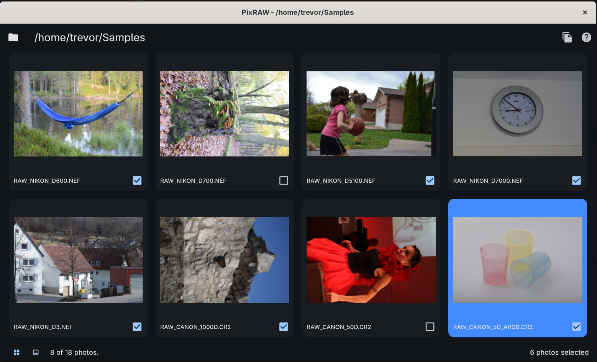
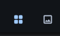
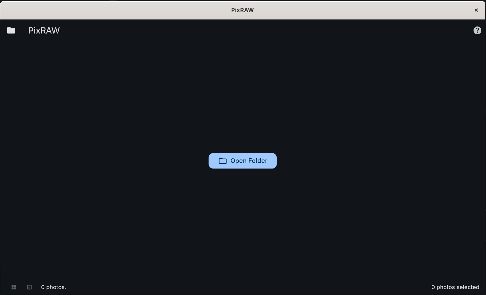
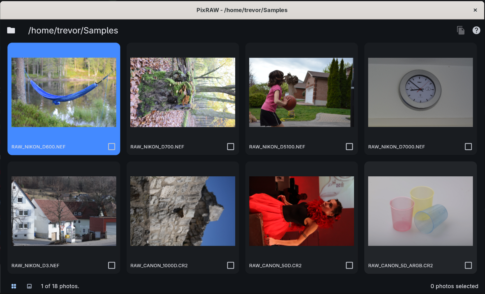
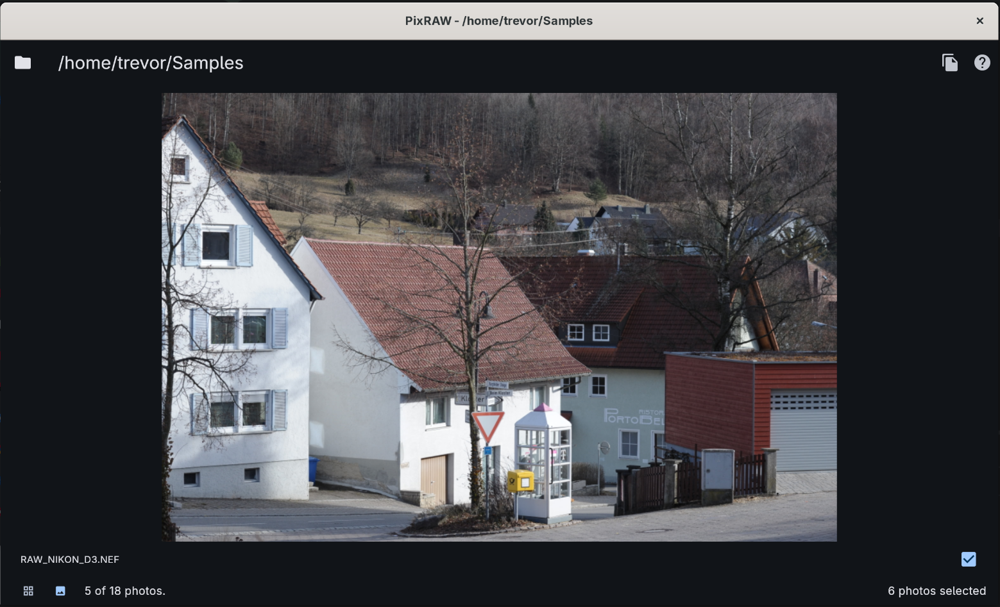
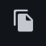
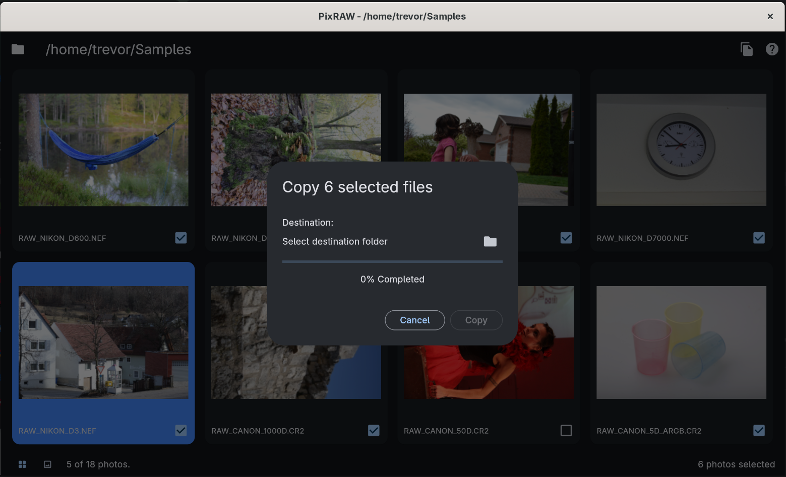
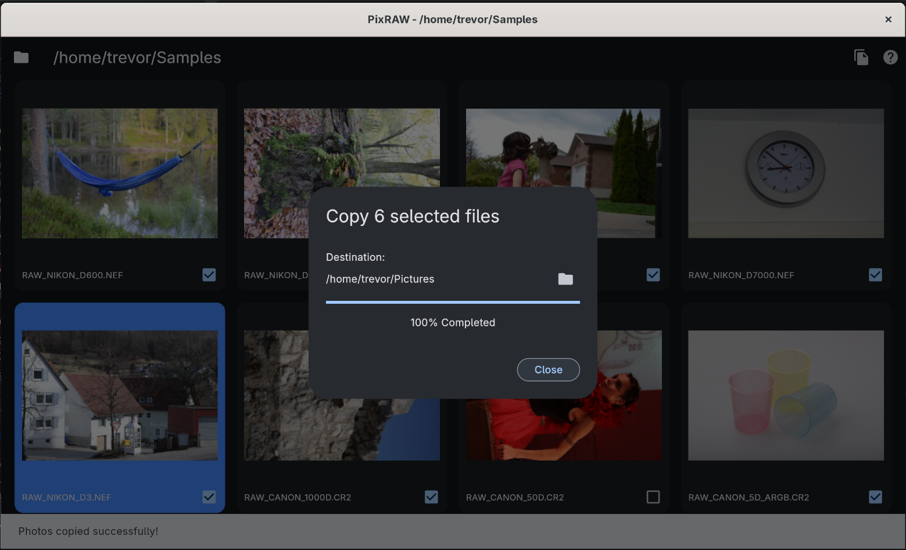

# PixRAW

PixRAW is a simple and easy to use RAW photo viewer and culling software application that is open source, specifically for the Linux platform and aimed at hobbyist and enthusiast photographers.

The primary goal of PixRAW is to be very simple and easy to use by providing a very intuitive and user-friendly user interface that provides an excellent user experience right out of the box.

## What is Photo Culling?
Photo culling is the process of sorting through a collection of photos to keep the best ones and remove duplicates, blurry shots, or unwanted images. It helps save time, reduce clutter, and leaves you with a polished selection of your strongest photos.

Photo culling software falls into two major categories: AI-powered platforms, which automate the detection of blurry images, duplicates, and closed eyes; and traditional/manual speed-viewers, which render raw files instantly so you can make your own selections without lag. PixRAW falls into this last category.

## Important PixRAW Concepts

PixRAW offers two view modes to help you work efficiently:
* **Grid View:** Displays all the photos in the folder in a grid layout.
* **Full Screen View:** Displays only one photo at a time for close inspection.

To toggle between these views you can use the toggle view buttons located in the bottom left of the application window.

> **Tip:** You can quickly toggle between these two views using the Enter key keyboard shortcut.

### Selected vs. Current Photo
PixRAW makes an important distinction between these two states:
* **Selected Photos:** These are the "keepers" you have chosen to copy or export. These will have checkbox that is checked.
* **Current Photo:** This is the current photo you are aon. In **Grid View**, it is highlighted in blue; in **Full Screen View**, it is the photo currently displayed on the screen.

## PixRAW Workflow

The basic workflow in PixRAW is as follows:

1. **Open a folder:** Select a folder containing your RAW photos. This can be on your local drive, an external hard drive, or a memory card (like an SD card) connected to your computer.
2. **Cull your shots:** Review the photos and select the ones you wish to keep.
3. **Export your keepers:** Copy the selected photos to a destination folder of your choice.

### 1. Open a Folder
When you launch PixRAW you are greeted with the home screen. It contains a single button that allows you to open a folder. Click on it and you are greeted with a standard Linux file / folder picker dialog box. Select the folder that contains your RAW photos.

If you would like to choose a different folder you can use the Open Folder icon button located at the top left of the application window.

### 2. Cull Photos
Once you have opened a folder, all the RAW photos in that folder will be displayed in the grid view in PixRAW.

You can toggle photos by clicking on the little checkbox in the bottom left corner of each photo. 
You can select which photo is the currently highlighted photo with a single click on any photo in grid view.

> **Tip:** You can quickly move the highlight to a different photo using the left and right arrow keys on the keyboard.

You can toggle between grid view and full screen view by double-clicking on any photo at any time within either of the views. In full screen view, you can use the left and right arrow keys to navigate between photos.

### 3. Copy Selected Photos
Once you have made your selections you are ready to copy them over to the folder of your choice.

Click on the copy button (only enabled when you have a photo selected).

This will bring up the copy dialog. 

Click on the folder icon button in the copy dialog to select the destination folder. Once you have a destination selected you can click on the Copy button in the dialog to copy the files. A progress bar will indicate the progress.

Once the copy completes, click on the Close button to dismiss the dialog.

> **Warning:** Currently PixRAW will overwrite a file with the same name that already exists in the destination folder.

## Keyboard Shortcuts
PixRAW makes navigating and selecting photos very easy and fast using some keyboard shortcuts:

* Enter key: toggles between grid view and full screen.
* Left and Right Arrow keys: Change the currently highlighted photo in gridview and navigate between photos in full screen view.
* Spacebar key: Select or deselect a "keeper" photo.